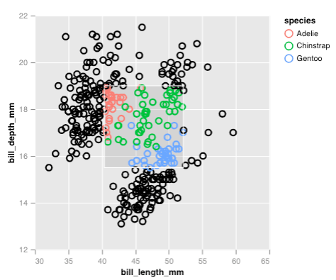
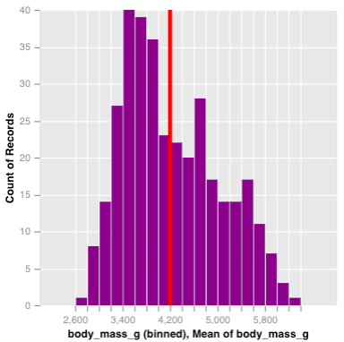
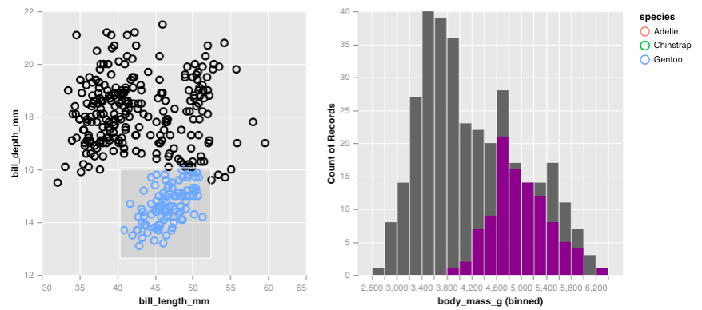

<!-- README.md is generated from README.Rmd. Please edit that file -->

```{r, include = FALSE}
knitr::opts_chunk$set(
  collapse = TRUE,
  comment = "#>",
  fig.path = "man/figures/README-",
  eval = FALSE,
  dev = "png"
)
```

# virgo

<!-- badges: start -->
[](https://codecov.io/gh/vegawidget/virgo?branch=master)
[](https://github.com/vegawidget/virgo/actions)
<!-- badges: end -->

The **virgo** package enables the creation of interactive graphics for
exploratory data analysis. It is an _idiomatic and opinionated_ R interface to 
the grammar of graphics implemented by [**Vega-Lite**](https://vega.github.io/vega-lite/) which
defines the following elements:

* aesthetic mappings/encodings via `enc()` 
* graphical elements like `mark_point()`, with the `mark_*` family of functions
* interactive objects, such as brushes (using `select_interval()`) and sliders (using `input_slider()`), via the `select_*` and `input_*` family of functions
* interactive calculations, for example mean (using `vg_mean()`), via the `vg_*` family of functions
* data transformations on selection objects for rich interactivity, with {dplyr} verbs
* plot composition via faceting and concatenation using `facet_views()`, `hconcat()` and `vconcat()`


## Installation

<!--
You can install the released version of **virgo** from [CRAN](https://CRAN.R-project.org) with:

``` r
install.packages("virgo")
```

-->

You can install the development version of **virgo** 
from [GitHub](https://github.com/) with:

``` r
# install.packages("remotes")
remotes::install_github("vegawidget/virgo")
```

## Get started

For most graphics using **virgo**, you start off by passing data to 
the `vega()` function, add graphical elements with marks like `mark_point()`, 
and specify variables within a mark using encodings `enc()`. You can add more 
layers by specifying additional marks like `mark_smooth()`, or include small 
multiples with `facet_views()` or combine plots or 
add interactive elements with selections.

Let's see an example, here we show how we can compose a simple scatter plot
and gradually build up to a scatter plot with brushing, to a side by side scatter plot.

```{r basic-scatter, eval = TRUE, out.width = "50%"}
library(virgo)
library(palmerpenguins)
p <- penguins %>% 
  vega() %>% 
  mark_circle(
    enc(
      x = bill_length_mm, 
      y = bill_depth_mm
    )
  )
p
```

Interactive elements are generated using selections, for example, 
we can generate a rectangular brush with `select_interval()` and 
then highlight points that fall into the brush using `encode_if()`:

```{r brushed-scatter}
selection <- select_interval()

p <- penguins %>% 
  vega() %>% 
  mark_circle(
    enc(
      x = bill_length_mm, 
      y = bill_depth_mm, 
      color = encode_if(selection, species, "black")
    )
  )
p
```



Once a selection is created, it can be passed into other marks, in order to
perform a filter. Here, we create a chart with two histogram layers,
the first will represent the overall distribution of penguin body masses, while
the latter will be the distribution conditional on the selection, and will
be shown in purple. We also overlay a vertical line to demonstrate the interactive average
given the selection.

```{r right-scatter}
p_right <- penguins %>% 
  vega(enc(x = body_mass_g)) %>% 
  mark_histogram(bin = list(maxbins = 20)) %>% 
  mark_histogram(color = "purple", bin = list(maxbins = 20),
    selection = selection) %>% 
  mark_rule(enc(x = vg_mean(body_mass_g)), color = "red", size = 4,
    selection = selection)
p_right
```



By itself, this histogram isn't too exciting but if we place along side
the scatter plot of penguin bill measurements, we can see how the body mass
counts change as we brush over the scatter plot. All we have do is simple
concatenate the plots horizontally!

```{r linked-brushed-scatter}
hconcat(p, p_right)
```



From this, we learn that the chinstrap and adelie penguins are generally
lighter and are less variable in their body mass compared to gentoo penguins.
The gentoo penguins are heavier, but also have a larger range of masses. 

## Learning more

- [Example gallery](articles/gallery/index.html)
- [Using **virgo** to explore Melbourne's microclimate](articles/virgo.html)
- [Guide to **virgo** for **ggplot2** users](articles/transition.html)
- [Composing plot interactions with selections]()

## Lifecycle

[](https://www.tidyverse.org/lifecycle/#experimental)

The **virgo** package is under rapid development and we are still working 
through our ideas for incorporating interactive graphics
into exploratory data analysis. If you have feedback we would love to hear it!

## Related works

* [{ggvis}](http://ggvis.rstudio.com) 
* [{vegalite}](https://github.com/hrbrmstr/vegalite)

## Acknowledgements

- Vega/Vega-Lite developers 
- Ian Lyttle, Hayley Jepson and Alicia Schep for their foundational
work in the [**vegawidget**](https://vegawidget.github.io/vegawidget/) package

